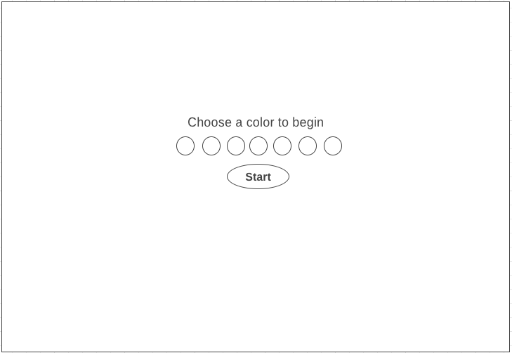
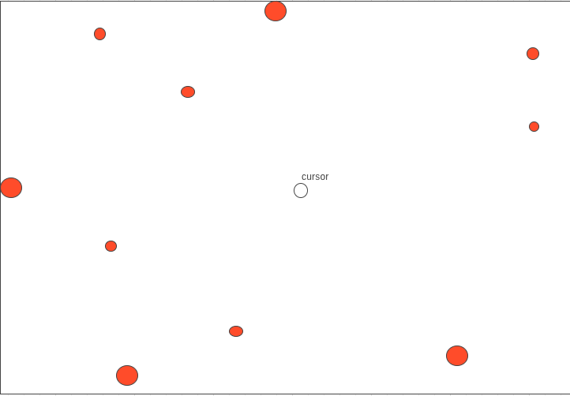
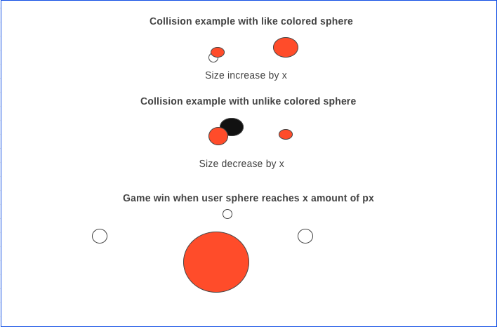

# spheres

-user chooses a color from a list of colors on the screen 
 
-game play begins and the cursor is a small sphere of the chosen color
 
-other multi colored spheres appear and start moving around the screen in a random order
 
-user must only merge with like-colored spheres
 
-once the user merges will all like-colored spheres on the screen the user will level up
 
-each level up will generate 15 new spheres making the game progressively harder
<<<<<<< HEAD
 
-if the user merges with spheres of different colores then the user will lose
=======

 
Game Start

 
Gameplay

 
Instructions

